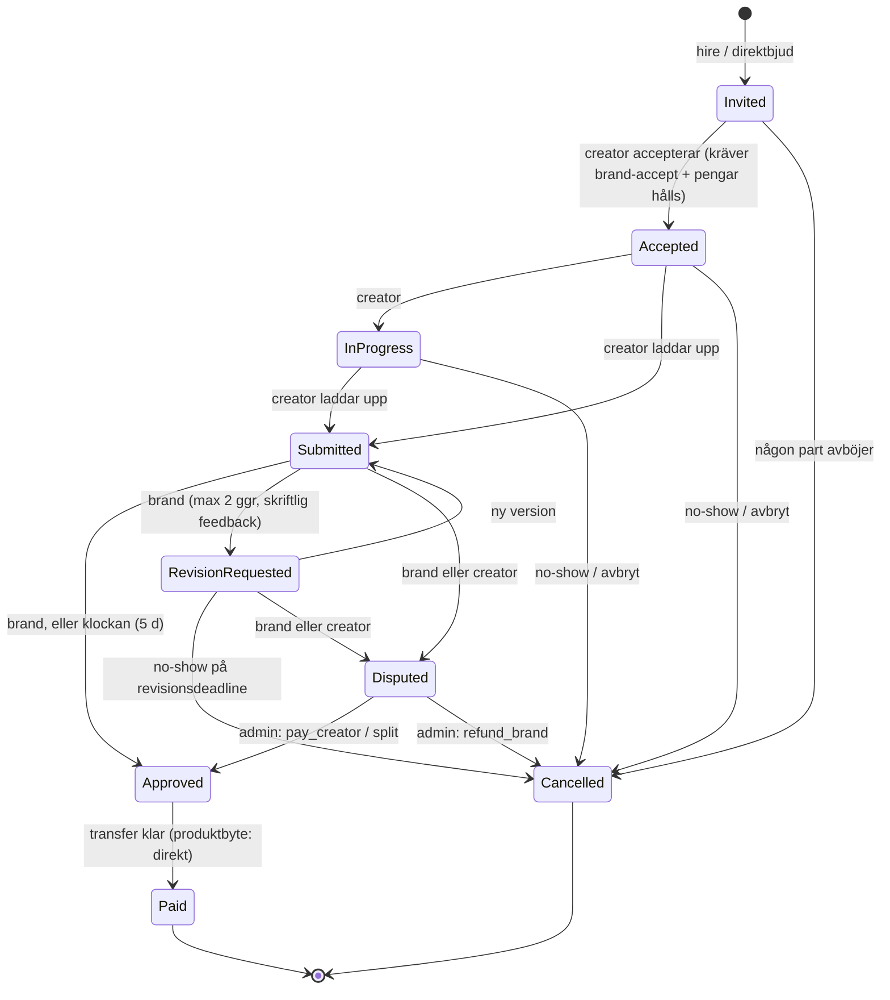

# UGC-marknadsplatsen — "Beställ video"

Ett företag beställer korta UGC-videor till fast pris. Pengarna hålls tills
leveransen är godkänd, kontraktet genereras från mall, och varje statusbyte
går genom en explicit state machine. Modulen är medvetet skild från
**kranen/kampanjerna** (`Campaign`, `CreatorCampaignAssignment`), som betalar
per verifierad view — det här är fasta leveranser med escrow.

> **Status:** Fas 1 klar (datamodell, migration, state machine, jobb, tester).
> Fas 2 (Stripe Connect + webhooks + API) och fas 3 (UI + AI-brief) väntar på klartecken.

## Var koden ligger

| Lager | Fil | Innehåll |
|---|---|---|
| Domain | `Enums/UgcEnums.cs` | Alla enums (status, rättighetspaket, aktörer …) |
| Domain | `Entities/UgcEntities.cs` | `UgcCreatorProfile`, `UgcCampaign`, `UgcApplication`, `UgcCollab`, `UgcDeliverable`, `UgcPayment`, `UgcWebhookEvent`, `UgcDispute`, `UgcMessage`, `UgcCollabEvent` |
| Domain | `Ugc/UgcCollabStateMachine.cs` | Transitionstabell + guards för collab, ansökan och kampanj |
| Domain | `Ugc/UgcFeeCalculator.cs` | Avgift, tvistfördelning, öre-formattering |
| Domain | `Ugc/UgcSchedule.cs` | Alla klockor: deadline, auto-approve, påminnelser, no-show |
| Domain | `Ugc/UgcVerificationRule.cs` | Automatiskt första filter, strikes, vem får söka |
| Application | `Ugc/UgcSettings.cs` | Konfiguration (sektionen `Ugc`) |
| Application | `Ugc/UgcContractGenerator.cs` + `Ugc/Contracts/*.md` | Kontraktsmallar (inbäddade) → text + SHA-256 |
| Application | `Ugc/IUgcPaymentGateway.cs` | Betalningsabstraktion (Stripe i fas 2) |
| Application | `Ugc/UgcSettlementService.cs` | Approved → Paid, Cancelled → refund, strikes, track record |
| Infrastructure | `Data/Configurations/UgcConfigurations.cs` | EF-mappning, tabeller `ugc_*` |
| Infrastructure | `Migrations/*_AddUgcMarketplace.cs` | 10 tabeller |
| Worker | `Jobs/UgcJobs.cs` | `UgcDeadlineJob` (xx:10) och `UgcAutoApproveJob` (xx:20), varje timme |
| Tests | `CreatorPay.Tests/Ugc/*` | 423 tester, körs utan databas/Docker |

## Antaganden som styrde bygget

Prompten utgick från ett annat repo än det Vyrle faktiskt är. Så här hanterades skillnaderna:

1. **Creator är ingen ny roll.** Vyrle har redan creators med onboarding, selfie, TikTok-OAuth, portfolio och utbetalningsmetod. Marknadsplatsen lägger en 1:1-utökning, `UgcCreatorProfile`, ovanpå `CreatorProfile` (verifieringsnivå, strikes, statistik, Stripe Connect, F-skatt/moms, portfolio-opt-out). Statusen på kärnkontot rörs aldrig.
2. **Det fanns ingen Stripe-integration.** Utbetalningar i kranen går via GigaPay. Modulen definierar `IUgcPaymentGateway`; `UnconfiguredUgcPaymentGateway` svarar ärligt "inte konfigurerad" tills Stripe kopplas in i fas 2. Jobben är byggda så att ett misslyckat anrop lämnar raden med orsak och försöker igen nästa timme.
3. **Det fanns inga AI-anrop.** "Generera brief med AI" byggs i fas 3 med Anthropic-API:et (`Anthropic__ApiKey`).
4. **Inga abonnemang/organisationer.** `BrandProfile` är organisationen; `OrganizationNumber` finns redan och krävs för publicering.
5. **Namn.** `Campaign`/`CampaignApplication`/`ChatMessage` är upptagna av kranen. Modulen använder prefixet `Ugc` och tabellerna `ugc_*`.
6. **Belopp i öre som `long`**, enligt prompten — en avsiktlig avvikelse från `decimal`-kronor i resten av koden. Håll gränsen: allt i modulen är öre.
7. **PR-hubben** (`PrOffer`: gåvor/direkterbjudanden utan escrow) finns kvar orörd. "Direktbjud från katalogen" i marknadsplatsen skapar en `UgcCollab` i `Invited`.
8. **L/F-kvot.** TikTok-profilen ger inte total likes; kvoten beräknas som likes på senaste videor / följare och sparas som ögonblicksbild på `UgcCreatorProfile` (fylls i fas 2:s verifieringstjänst).
9. **Filer.** Nuvarande `IFileStorageService` skriver till lokal disk (100 MB-tak). För videoleveranser krävs objektlagring (R2/S3) — beslut behövs innan fas 3. `UgcDeliverable` är lagringsagnostisk (`FileUrl` + `FileKey`).

## Flöde

```
Brand                        System                         Creator
─────                        ──────                         ───────
skapa UgcCampaign (Draft)
[AI-brief, fas 3]
publicera ──────────────────► matcha creators, notis ──────► ansök med bud + pitch
                                                             (UgcApplication: Applied)
preselecta / hira ──────────► UgcCollab: Invited
                              kontrakt genereras (text + hash)
acceptera + betala ─────────► pengar hålls (UgcPayment: Held)
                                                             acceptera kontrakt
                              ► Accepted, DeadlineAt = nu + DeadlineDays
                              påminnelse 48 h / 24 h ──────► 
                                                             ladda upp ► Submitted
                              AutoApproveAt = nu + 5 d
                              påminnelse 24 h före ◄────────
godkänn  ─────────────────►   Approved → transfer → Paid ──► pengar + licensbevis
eller begär revision ──────►  RevisionRequested (max 2, ny deadline 3 d) ─► ny version
                              deadline passerad utan leverans:
                              Cancelled, full refund, strike (3 → Suspended)
tvist (båda) ─────────────►   Disputed: auto-approve fryst, admin avgör
                              pay_creator / refund_brand / split
```

## Statusdiagram (collab)



Vem som får göra vad finns i tabellen `Rules` i `UgcCollabStateMachine` och
testas uttömmande (varje (från, till, aktör)-trippel) i
`UgcCollabStateMachineTests`. Ändra tabellen → uppdatera `Expected` i testet.

**Ansökan:** `Applied → Preselected → Hired`, ut via `Rejected` (brand) eller `Withdrawn` (creator).
**Kampanj:** `Draft → Published → Closed`. Publicering kräver org.nr.

## Pengar

- Creatorn får exakt det överenskomna beloppet. Vyrles avgift (`Ugc:PlatformFeePercent`, default 15 %) läggs **ovanpå** och betalas av företaget. `UgcFeeCalculator.Quote(150_000, 15)` → creator 1 500 kr, avgift 225 kr, företaget betalar 1 725 kr.
- Avrundning: hela öre, halva öre bort från noll.
- **No-show:** full återbetalning inklusive avgift — inget levererades.
- **Tvist:** `pay_creator` → hela beloppet till creatorn; `refund_brand` → allt inkl. avgift tillbaka; `split` → creatorns andel (%) av det överenskomna beloppet, avgiften behålls.
- Produktbyte: ingen betalning, `UgcPayment.Status = NotApplicable`, samma kontrakt och statusflöde. Kontraktet innehåller standardtexten om att creatorn själv ansvarar för skatt på produkten.

Stripe-modellen i fas 2 är *separate charges and transfers*: PaymentIntent på
plattformskontot vid hire (→ `Held`), Transfer till creatorns Express-konto
vid approve (→ `Transferred`), Refund vid cancel/tvist. Kortdata lagras aldrig.
`UgcWebhookEvent` med unikt index på (provider, event_id) är idempotensspärren.

## Kontrakt

Mallarna ligger i `Ugc/Contracts/*.md` och bäddas in i assemblyn
(`WithCulture=false` — `.sv` i filnamnet är ett språk, inte en kultur).
`UgcContractGenerator.Generate` fyller platshållare, stryker HTML-kommentarer,
normaliserar radslut och hashar (SHA-256). Samma indata ger alltid samma hash,
på alla plattformar. Hashen sparas på collab:en tillsammans med båda parternas
accept-tidsstämplar.

**Texterna är utkast och kräver juridisk granskning.** Ändra i `.md`-filerna,
inte i koden, och bumpa `Ugc:ContractTemplateVersion` så att ingångna avtal
behåller sin version.

## Jobb (idempotenta, kan köras om)

| Jobb | Cron | Gör |
|---|---|---|
| `UgcDeadlineJob` | `10 * * * *` | Påminnelser 48 h/24 h före deadline (markörer `DeadlineReminder*SentAt`); no-show → Cancelled, refund, strike, notiser |
| `UgcAutoApproveJob` | `20 * * * *` | Påminnelse 24 h före auto-approve; auto-approve när klockan gått; försöker igen med transfer för allt som står i `Approved` |

Varje rad sparas för sig; en trasig rad loggas och stoppar inte de andra.
Alla beslut tas från tidsstämplar och markörer på raden, aldrig från "när
jobbet råkade köra" — det är vad `UgcJobsTests` kör varje scenario två gånger
för att bevisa.

## Miljövariabler / konfiguration

Sektionen `Ugc` (alla valfria, defaults i `UgcSettings`):

| Nyckel | Default | Betydelse |
|---|---|---|
| `Ugc__PlatformFeePercent` | `15` | Avgift i % av creatorbeloppet |
| `Ugc__AutoApproveDays` | `5` | Granskningsfönster efter leverans |
| `Ugc__RevisionDeadlineDays` | `3` | Ny, kortare deadline per revisionsrunda |
| `Ugc__MaxRevisions` | `2` | Revisionsrundor per collab |
| `Ugc__StrikesToSuspend` | `3` | No-shows innan avstängning |
| `Ugc__AutoVerifyMinFollowers` | `1000` | Tröskel för automatisk verifiering |
| `Ugc__AutoVerifyMinLikeFollowerRatio` | `0.05` | Tröskel för L/F-kvot |
| `Ugc__RequireFTaxForPaid` | `false` | Blockera betalda uppdrag utan F-skatt |
| `Ugc__ContractTemplateVersion` | `2026-09-draft-1` | Version på mallsatsen |

Fas 2 lägger till: `Stripe__SecretKey`, `Stripe__WebhookSecret`, `Stripe__ConnectClientId`.
Fas 3 lägger till: `Anthropic__ApiKey` (AI-brief) och objektlagring för video.

## Stripe-webhooks lokalt (fas 2)

```bash
stripe login
stripe listen --forward-to https://localhost:5001/api/ugc/webhooks/stripe
# skriv ut whsec_… i Stripe__WebhookSecret
stripe trigger payment_intent.succeeded
```

Endpointen verifierar signaturen, skriver `UgcWebhookEvent` (unikt event-id)
och först därefter agerar — ett event som redan finns i tabellen är ett no-op.

## Nästa steg

**Fas 2 — betalning + API**
- `StripeUgcPaymentGateway` (PaymentIntent, Transfer, Refund, Connect Express-onboarding)
- Webhook-endpoint med idempotens + tester
- Tjänster/endpoints: kampanj CRUD + publicera, ansök/bud, preselect/hire/direktbjud, kontrakt-accept + betalning, leverans, godkänn/revision, tvist, meddelanden, admin-verifiering och tvistkö
- Verifieringstjänst (social snapshot + `UgcVerificationRule`)
- Licensbevis (PDF) vid Paid

**Fas 3 — UI**
- Brand: kampanjlista, kampanjbyggare med AI-brief, ansökningsvy, kanban-pipeline, granskningsvy med videospelare + versioner, chatt
- Creator: matchande kampanjer, mina ansökningar, mina collabs, uppladdning, intäkter
- Admin: verifieringskö, tvistkö, avgiftsinställningar

## Öppna frågor (behöver svar före fas 2)

1. Finns ett Stripe-konto med Connect aktiverat (Express, SE)? Annars: vem skapar det?
2. Objektlagring för video: Cloudflare R2, S3 eller annat?
3. Ska PR-hubben på sikt slås ihop med marknadsplatsens direktbjudan, eller leva parallellt?
4. F-skatt-krav på från start (`Ugc__RequireFTaxForPaid=true`) eller först senare?
5. Anthropic-nyckel för AI-brief — ok att lägga i Railway?
